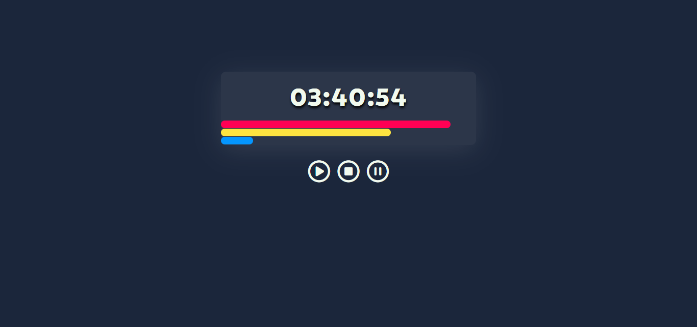

# Timer em TypeScript
Este projeto é um cronômetro simples criado usando TypeScript e POO (Programação Orientada a Objetos). O cronômetro exibe o tempo decorrido em horas, minutos e segundos, além de barras de progresso para representar visualmente o tempo passado em cada escala.
<br>
<br>


# Design e Funcionalidade
O Timer possui uma interface simples e intuitiva, composta por um display principal que mostra o tempo no formato "HH:MM:SS" (horas, minutos e segundos). Abaixo do display, há três barras coloridas que representam visualmente o progresso das horas, minutos e segundos.

O Timer pode ser controlado através de três botões:

- **Botão "Play":** Inicia o Timer, permitindo que o tempo seja contado em segundos, minutos e horas. Ao clicar no botão "Play", o Timer começa a contar a partir de zero, e as barras começam a preencher-se à medida que o tempo passa.
- **Botão "Pause":** Pausa o Timer, interrompendo a contagem do tempo. Ao clicar no botão "Pause", o Timer para de contar, e as barras permanecem no ponto em que estavam no momento da pausa.
- **Botão "Reset":** Reseta o Timer, reiniciando o contador para zero e redefinindo todas as barras para o estado inicial. Ao clicar no botão "Reset", o Timer volta a zero, e todas as barras são reinicializadas.

As barras têm cores diferentes para cada unidade de tempo: segundos são representados pela cor rosa, minutos pela cor amarela e horas pela cor azul. À medida que o tempo avança, as barras crescem em proporção ao tempo decorrido em cada unidade.

# Tecnologias

O Timer foi construído usando as seguintes tecnologias:

- **TypeScript:** Linguagem de programação fortemente tipada que adiciona recursos de tipagem estática ao JavaScript, tornando o código mais seguro e legível.
- **HTML:** A estrutura básica da página, onde os elementos do Timer são criados.
- **CSS:** Responsável por fornecer o estilo visual para o Timer, criando uma experiência agradável para o usuário.
- **Webpack:** Usado para empacotar o código TypeScript e suas dependências em um único arquivo JavaScript executável no navegador.

# Construção do Timer
O Timer foi construído seguindo os princípios da Programação Orientada a Objetos (POO) e utilizando os recursos fornecidos pelo TypeScript para tipagem estática e encapsulamento.

A classe `Timer` foi criada para representar o Timer, com suas propriedades e métodos. Foram utilizados modificadores de acesso como `private` para proteger as propriedades do Timer e controlar o acesso a elas. Métodos privados foram utilizados para realizar operações internas do Timer, como incrementar o tempo e atualizar as barras. Além disso, foram criados tipos personalizados para representar os valores de tempo e a interface dos elementos da página.

O Timer interage com a interface HTML utilizando o DOM (Document Object Model). Os elementos do Timer, como o display do tempo, as barras e os botões, são acessados por meio de seletores do DOM e manipulados dinamicamente através do TypeScript.

# Como executar o projeto
Para utilizar esse projeto na sua máquina local siga estas etapas:
- Certifique-se de ter o **Node.js** e o **npm** instalados em sua máquina.
- Clone o repositório para sua máquina local utilizando o seguinte comando:
```bash
  git clone https://github.com/ViniciusQuintas/timer.git
```
- Após clonar o repositório, navegue até o diretório do projeto no terminal:
```bash
  cd timer
```
- Instale todas as dependências do projeto listadas no arquivo `package.json` com o seguinte comando:
```bash
  npm install
```
- Após a instalação das dependências, execute o seguinte comando para compilar o código TypeScript e criar o arquivo `bundle.js` necessário para a execução do timer.
```bash
  npm run build
```
- Por fim, abra o arquivo `index.html` no seu navegador para utilizar o timer.

# Contribuição
Se você deseja contribuir para o desenvolvimento desse projeto, siga os seguintes passos:

 1️⃣ Faça um fork deste repositório. 
<br>
<br>
 2️⃣ Crie uma nova branch para sua contribuição. 
<br>
<br>
 3️⃣ Faça suas alterações no código. 
<br>
<br>
 4️⃣ Certifique-se de que suas alterações não quebram o funcionamento existente do projeto. 
<br>
<br>
 5️⃣ Faça um pull request com suas alterações. 
<br>
<br>

# Licença
Este projeto está licenciado sob a Licença MIT. Consulte o arquivo LICENSE para obter mais informações.
